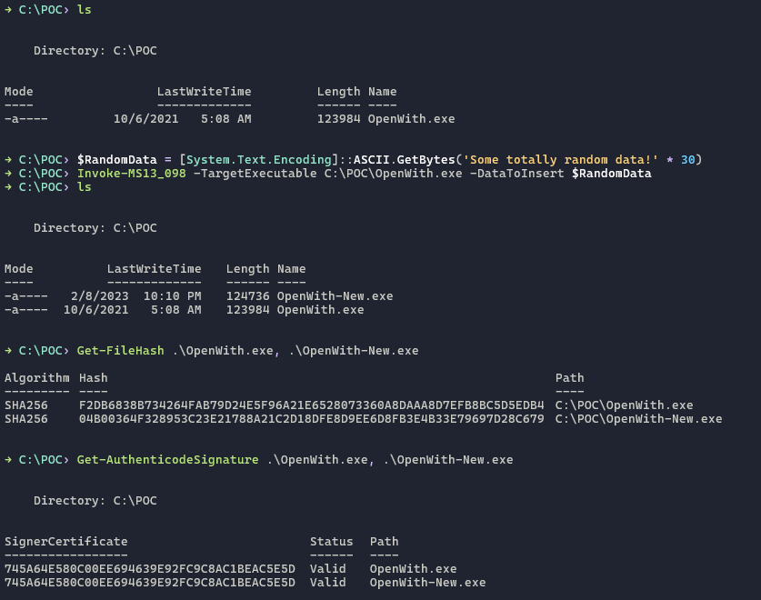
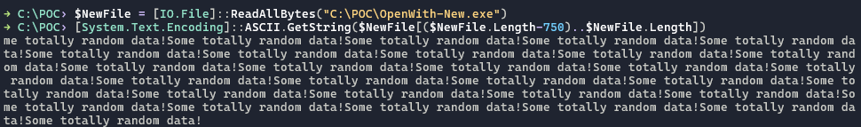

# Invoke-MS13_098
PowerShell script to append data to executables without invalidating their digital signature.

---

With Security Update [MS13-098](https://learn.microsoft.com/en-us/security-updates/securitybulletins/2013/ms13-098) installed, and *enabled, the new behavior for Windows Authenticode signature verification will no longer allow extraneous information in the WIN_CERTIFICATE structure and Windows will no longer recognize non-compliant binaries as signed.

**Requires setting [registry key(s)](https://learn.microsoft.com/en-us/security-updates/SecurityAdvisories/2014/2915720?redirectedfrom=MSDN#suggested-actions)*

---

